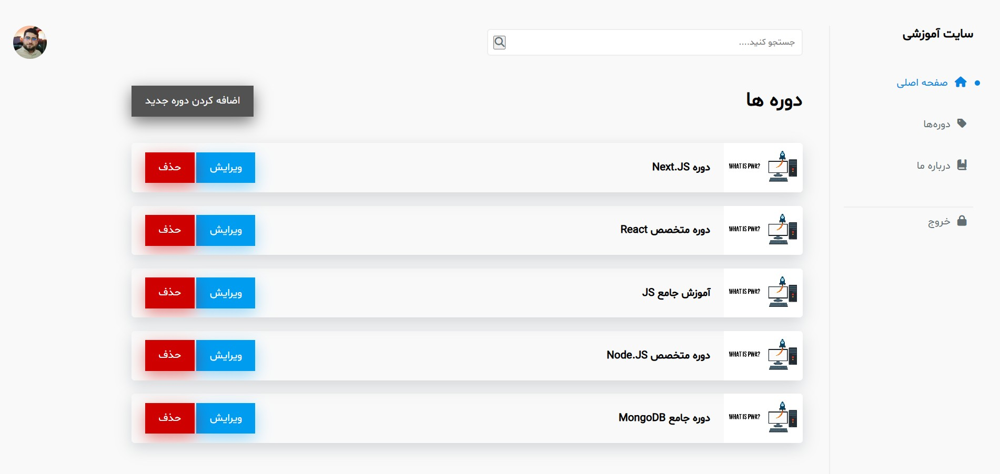

# Course Management Panel (Node.js + EJS)

A simple course management dashboard built with **Node.js**, **Express**, **MongoDB**, and **EJS** following the **MVC architecture**.

This project is designed as a practical admin panel for managing courses and is intended to showcase backend and server-side rendering skills.

---

## 🚀 Features

- Create new courses
- Edit existing courses
- Delete courses
- Search courses by title
- Server-side rendering with EJS
- Clean MVC structure
- MongoDB integration with Mongoose
- Error handling and validation
- RTL layout (Persian UI)

---

## 🧠 Technologies Used

- Node.js
- Express.js
- MongoDB
- Mongoose
- EJS
- CSS (Custom)
- MVC Architecture

---

## 📁 Project Structure

```

├── configs
│   └── db.js
├── controllers
│   └── v1
│       └── course.js
├── models
│   └── course.js
├── routers
│   └── v1
│       └── course.js
├── public
│   ├── css
│   ├── images
│   └── js
├── views
│   ├── partials
│   └── index.ejs
├── .env
├── app.js
├── server.js
└── package.json

```

---

## 🔎 Course Search Logic

Courses can be searched using a case-insensitive keyword search:

```js
title: { $regex: keyword, $options: "i" }
```

---

## ⚙️ Installation & Setup

1. Clone the repository:

```bash
git clone https://github.com/your-username/course-management-panel-nodejs.git
```

2. Install dependencies:

```bash
npm install
```

3. Create a `.env` file:

```env
PORT=3000
MONGO_URI=your_mongodb_connection_string
```

4. Run the project:

```bash
npm run dev
```

---

## 🖥️ Project Preview

<p align="center">
  
</p>

<p align="center">
  <strong>Course Management Admin Panel</strong><br/>
  Built with Node.js, Express, MongoDB & EJS
</p>

---

## 📌 Notes

- Authentication and user management are not included in this project.
- This project focuses on CRUD operations, MVC structure, and server-side rendering.

---

## 👨‍💻 Author

**Mohammad-JBM**
Backend Developer | Node.js